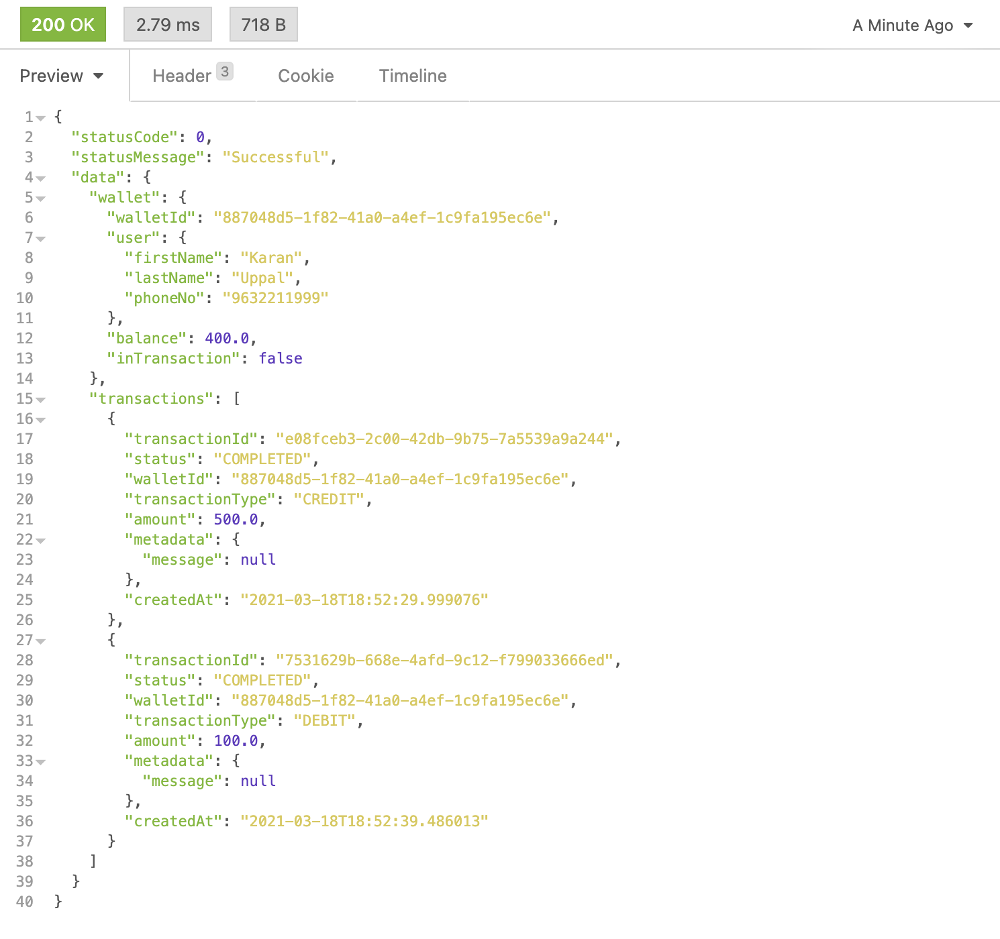
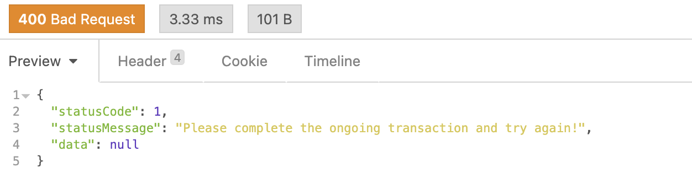
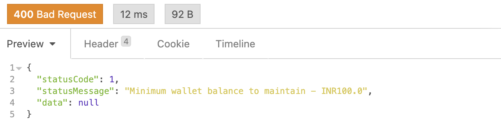

# e-Wallet Transaction System
This is a very basic e-Wallet Transaction System that provides small  features revolving around user's wallets.

### Functional Requirements
* Create a wallet (with phone number and name)
* Create a debit transaction (with checks on maximum debit amount, minimum wallet balance)
* Create a credit transaction
* Get current wallet status (balance,  list of transactions etc.)
* Minimum wallet balance to be maintained, driven via configuration.
* A maximum cap on a single debit request, driven via configuration.

### Non-Functional Requirements
* Handle simultaneous debits, honouring the first request and asking the user to re-try on the second request.

### Execution Details
* `/src/main/java/com/ewallet` contains all the solution files.
* `/src/main/java/resources` contains the resources files - application.properties
* `gradle clean build` to create an executable JAR.
* `java -jar build/libs/e-wallet-1.0.jar` to run the JAR.

### Config Properties:
* Minimum wallet balance to maintain: `limits.min-wallet-balance` (default = 100)
* Maximum debit limit for users: `limits.max-debit` (default = 1000)

### cURL Requests
* Create Wallet:
```
curl --request POST \
  --url http://localhost:8080/api/v1/wallet/create \
  --header 'Content-Type: application/json' \
  --data '{
	"phoneNo" : "9632211999",
	"firstName": "Karan",
	"lastName": "Uppal"
}'
```
* Get Wallet Status (Balance, Transactions etc.):
```
curl --request GET \
  --url http://localhost:8080/api/v1/wallet/status/9632211999 \
  --header 'Content-Type: application/json'
```
* Credit Wallet:
```
curl --request POST \
  --url http://localhost:8080/api/v1/transact/credit \
  --header 'Content-Type: application/json' \
  --data '{
	"phoneNo" : "9632211999",
	"amount": 500
}'
```
* Debit Wallet:
```
curl --request POST \
  --url http://localhost:8080/api/v1/transact/debit \
  --header 'Content-Type: application/json' \
  --data '{
	"phoneNo" : "9632211999",
	"amount": 100
}'
```
### Demo Response 
* Create Wallet, Credit 500, Debit 100, Check Status:

* Create Wallet, Credit 500, Debit 100, (10s sleep), Debit 100:
 
* Create Wallet, Debit 100:

